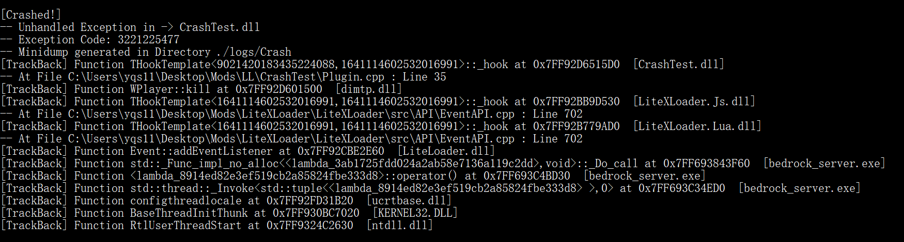
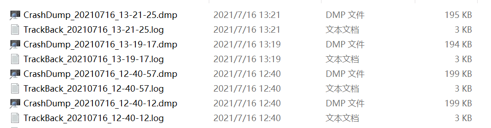

# CrashLogger
> Provide crash listener for any process, and dump stack when the process is crashed.

## Usage

### Use as a single daemon process

1. Start the program you want to listen to, and get its ProcessID
2. Execute in terminal: `CrashLogger_Daemon.exe <ProcessID>`
3. **Finished.** When the target process crashed, the daemon will dump its stack and output stacktrace to console.

### Work along with  your program

1. Use `LoadLibrary` to load `CrashLogger.dll`.
2. `CrashLogger.dll` will start `CrashLogger_Daemon.exe` in background and start daemon.
3. **Finished.** When your process crashed, the daemon will dump its stack and output stacktrace to console.

## At Crash
- Result of stack walk will output both at console and file  `.\logs\Crash\TrackBack_xxxxxxxx_xx-xx-xx.log`
- Dumpbin database will generate at file `.\logs\Crash\CrashDump_xxxxxxxx_xx-xx-xx.dmp`  

- Stack walk can give you a general view of possible problems.

Using CrashDump, Dump files and WinDbg or Visual Studio, you can get more infomation about the crash.

## PDB Files

CrashLogger will find PDB files in target process's directory, which contains significant symbol information for stacktrace. So you can put PDBs of your program or the libraries you used into `.\PDB` directory. It will helps a lot.

## Tips

CrashLogger attach to the target program as a debugger to catch unhandled exception and crash. So if another debugger is attached before (like Visual Studio Debugger), CrashLogger will not work.